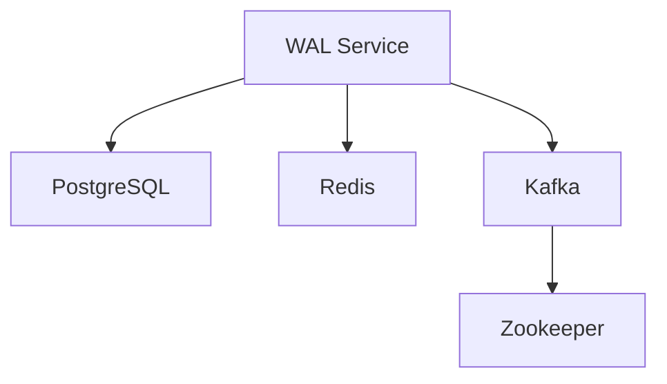

# WAL Service Development Setup

This guide provides complete instructions for setting up the WAL Service development environment with Docker Compose, including debugging capabilities and end-to-end testing.

## 🚀 Quick Start

1. **Prerequisites Check**
   ```bash
   # Ensure Docker Desktop is running
   docker --version
   docker compose version
   ```

2. **Initial Setup**
   ```bash
   # Run the setup script (one-time setup)
   ./dev-setup.sh setup
   ```

3. **Start Development Environment**
   ```bash
   # Start all services
   ./dev-setup.sh start
   
   # Or manually
   docker compose -f docker-compose.dev.yml up -d
   ```

4. **Access Your Application**
   - **Application**: http://localhost:3000
   - **Health Check**: http://localhost:3000/api/v1/health
   - **Swagger/OpenAPI**: http://localhost:3000/api/docs
   - **Debug Port**: localhost:9229

## 🏗️ Architecture Overview

The development environment includes:

### Core Services
- **WAL Service** (`wal-service-dev`) - Main application with hot reload
- **PostgreSQL** (`postgres-dev`) - Database on port 5432
- **Redis** (`redis-dev`) - Cache/message broker on port 6379
- **Zookeeper** (`zookeeper-dev`) - Kafka coordination on port 2181
- **Kafka** (`kafka-dev`) - Message streaming on port 9092

### Service Dependencies


## 🛠️ Development Scripts

The `dev-setup.sh` script provides comprehensive environment management:

### Basic Operations
```bash
./dev-setup.sh start         # Start all services
./dev-setup.sh stop          # Stop all services
./dev-setup.sh restart       # Restart all services
./dev-setup.sh status        # Show service status
./dev-setup.sh health        # Check health of all services
```

### Development Operations
```bash
./dev-setup.sh rebuild       # Rebuild WAL service only
./dev-setup.sh logs          # Follow logs for all services
./dev-setup.sh logs-app      # Follow logs for WAL service only
./dev-setup.sh logs-db       # Follow logs for database services
```

### Debugging Operations
```bash
./dev-setup.sh debug         # Start with debugging info
./dev-setup.sh shell         # Get shell in WAL container
./dev-setup.sh db-shell      # Access PostgreSQL shell
./dev-setup.sh redis-cli     # Access Redis CLI
./dev-setup.sh kafka-topics  # List Kafka topics
```

### Cleanup
```bash
./dev-setup.sh clean         # Remove containers, networks, and volumes
```

## 🐛 Debugging Setup

### VS Code Debugging

1. **Automatic Setup**: The development environment includes a pre-configured `.vscode/launch.json`

2. **Debugging Steps**:
   ```bash
   # 1. Start development environment
   ./dev-setup.sh start
   
   # 2. Wait for services to be ready (check logs)
   ./dev-setup.sh logs-app
   
   # 3. In VS Code, go to Debug panel (Ctrl+Shift+D)
   # 4. Select "Docker: Attach to WAL Service"
   # 5. Click the green play button
   ```

3. **Debug Configuration Details**:
   - **Debug Port**: 9229
   - **Local Root**: `${workspaceFolder}/src`
   - **Remote Root**: `/app/src`
   - **Auto-restart**: Enabled

### Breakpoint Debugging

1. **Set Breakpoints**: Click in the gutter next to line numbers in VS Code
2. **Step Through Code**: Use F10 (step over), F11 (step into), F12 (step out)
3. **Inspect Variables**: Hover over variables or use the Variables panel
4. **Console Access**: Use the Debug Console to execute expressions

### Chrome DevTools (Alternative)

```bash
# 1. Start the services
./dev-setup.sh start

# 2. Open Chrome and navigate to:
chrome://inspect

# 3. Click "Open dedicated DevTools for Node"
# 4. Set breakpoints and debug
```

## 📊 Service Configuration

### Environment Variables

The development environment uses these key environment variables:

```bash
# Application
NODE_ENV=development
NODE_OPTIONS=--inspect=0.0.0.0:9229 --max-old-space-size=4096
APP_PORT=3000
LOG_LEVEL=debug

# Database
DATABASE_HOST=postgres-dev
DATABASE_PORT=5432
DATABASE_USERNAME=wal_user
DATABASE_PASSWORD=wal_password
DATABASE_NAME=wal_service_db

# Redis
REDIS_HOST=redis-dev
REDIS_PORT=6379

# Kafka
KAFKA_BROKERS=kafka-dev:29092
KAFKA_CLIENT_ID=wal-service-dev
```

### Volume Mounts

- **Source Code**: `./src:/app/src:cached` (Hot reload)
- **Configuration**: `./package.json`, `./tsconfig.json`, etc. (Read-only)
- **Logs**: `./logs:/app/logs:delegated`
- **Node Modules**: `node_modules_cache:/app/node_modules` (Performance)

## 🔧 Development Workflow

### 1. Code Changes
- Edit files in `src/` directory
- Changes automatically trigger hot reload
- Check logs: `./dev-setup.sh logs-app`

### 2. Database Operations
```bash
# Access database
./dev-setup.sh db-shell

# Run migrations
docker compose -f docker-compose.dev.yml exec wal-service-dev npm run migration:run

# Seed data
docker compose -f docker-compose.dev.yml exec wal-service-dev npm run db:seed
```

### 3. Redis Operations
```bash
# Access Redis CLI
./dev-setup.sh redis-cli

# Common Redis commands
> KEYS *                    # List all keys
> GET key_name              # Get value
> FLUSHALL                  # Clear all data
```

### 4. Kafka Operations
```bash
# List topics
./dev-setup.sh kafka-topics

# Create topic
docker compose -f docker-compose.dev.yml exec kafka-dev \
  kafka-topics --create --topic test-topic --bootstrap-server localhost:9092

# Consume messages
docker compose -f docker-compose.dev.yml exec kafka-dev \
  kafka-console-consumer --topic test-topic --from-beginning --bootstrap-server localhost:9092
```

## 🧪 Testing

### Running Tests
```bash
# Inside the container
docker compose -f docker-compose.dev.yml exec wal-service-dev npm test

# Specific test file
docker compose -f docker-compose.dev.yml exec wal-service-dev npm test -- --testPathPatterns="wal.service.spec.ts"

# Coverage report
docker compose -f docker-compose.dev.yml exec wal-service-dev npm run test:cov
```

### End-to-End Testing
```bash
# Start services
./dev-setup.sh start

# Wait for health check
curl http://localhost:3000/api/v1/health

# Test WAL endpoint
curl -X POST http://localhost:3000/api/v1/wal/write \
  -H "Content-Type: application/json" \
  -H "X-API-Key: dev-api-key" \
  -d '{
    "namespace": "test-namespace",
    "payload": {"message": "Hello WAL"},
    "lifecycle": {"delay": 0}
  }'
```

## 📋 Troubleshooting

### Common Issues

#### 1. Services Not Starting
```bash
# Check Docker is running
docker info

# Check service logs
./dev-setup.sh logs

# Restart services
./dev-setup.sh restart
```

#### 2. Port Conflicts
```bash
# Check if ports are in use
lsof -i :3000
lsof -i :5432
lsof -i :6379
lsof -i :9092

# Kill conflicting processes
kill -9 <PID>
```

#### 3. Database Connection Issues
```bash
# Check PostgreSQL health
docker compose -f docker-compose.dev.yml exec postgres-dev pg_isready -U wal_user

# Reset database
./dev-setup.sh stop
docker volume rm wal_postgres_dev_data
./dev-setup.sh start
```

#### 4. Hot Reload Not Working
```bash
# Check file permissions
ls -la src/

# Rebuild service
./dev-setup.sh rebuild
```

#### 5. Debugging Not Working
```bash
# Check debug port is exposed
docker compose -f docker-compose.dev.yml ps wal-service-dev

# Check Node.js debug flags
docker compose -f docker-compose.dev.yml logs wal-service-dev | grep inspect

# Restart with fresh container
./dev-setup.sh rebuild
```

### Health Check Commands
```bash
# Check all services
./dev-setup.sh health

# Individual service health
curl -f http://localhost:3000/api/v1/health          # WAL Service
docker compose -f docker-compose.dev.yml exec postgres-dev pg_isready -U wal_user  # PostgreSQL
docker compose -f docker-compose.dev.yml exec redis-dev redis-cli ping             # Redis
```

### Performance Optimization

#### For macOS Development
The compose file includes macOS-optimized volume mounts:
- `:cached` - Better read performance
- `:delegated` - Better write performance  
- `:ro` - Read-only mounts

#### Node.js Memory
Configured with `--max-old-space-size=4096` for development builds.

## 📁 Directory Structure

```
wal-service/
├── .vscode/
│   └── launch.json          # VS Code debug configuration
├── src/                     # Source code (hot reload enabled)
├── logs/                    # Application logs
├── docker-compose.dev.yml   # Development compose file
├── dev-setup.sh            # Development management script
├── .env                    # Environment variables
├── .env.local              # Local environment overrides
└── DEVELOPMENT.md          # This file
```

## 🎯 Next Steps

1. **Start Development**: `./dev-setup.sh start`
2. **Set Breakpoints**: In VS Code, set breakpoints in your code
3. **Attach Debugger**: Use "Docker: Attach to WAL Service" configuration
4. **Test API**: Hit http://localhost:3000/api/v1/health
5. **Monitor Logs**: Use `./dev-setup.sh logs-app` to monitor application logs

## 📞 Support

For issues with this development setup:
1. Check the troubleshooting section above
2. Review service logs: `./dev-setup.sh logs`
3. Verify service health: `./dev-setup.sh health`
4. Clean and restart: `./dev-setup.sh clean && ./dev-setup.sh setup && ./dev-setup.sh start`