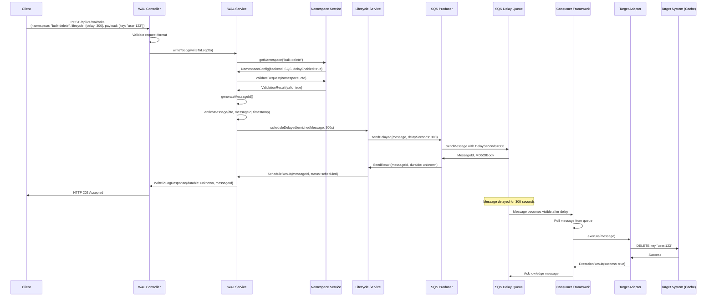
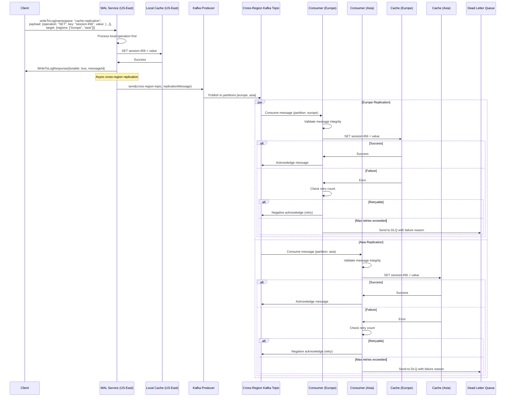
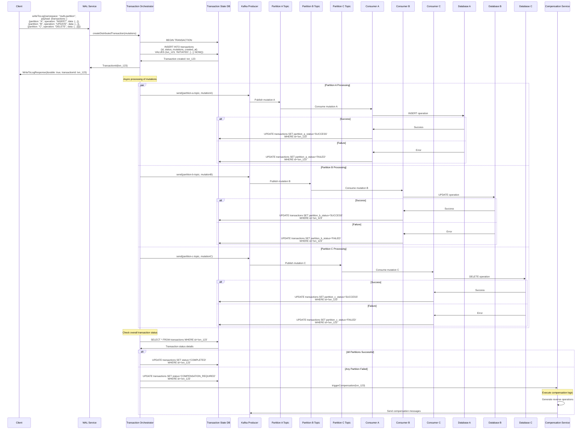
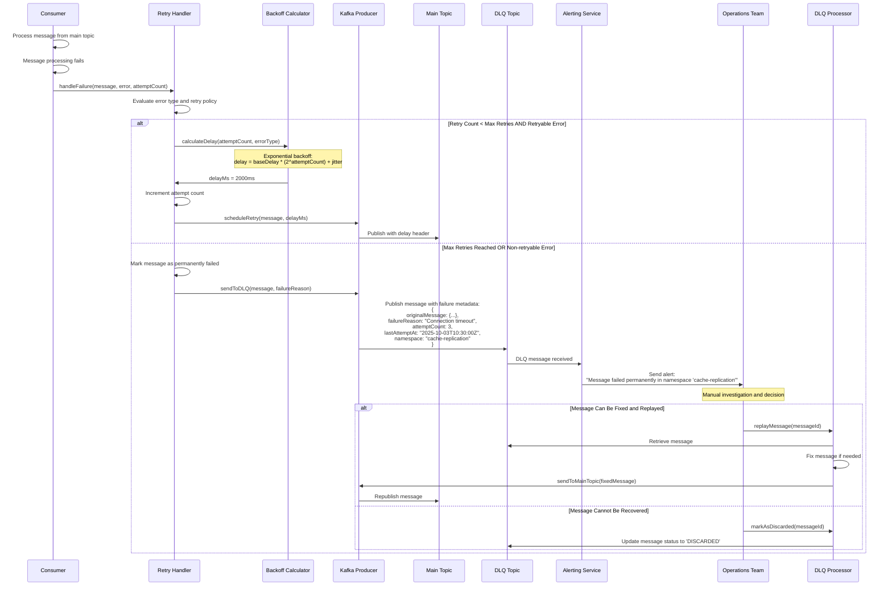
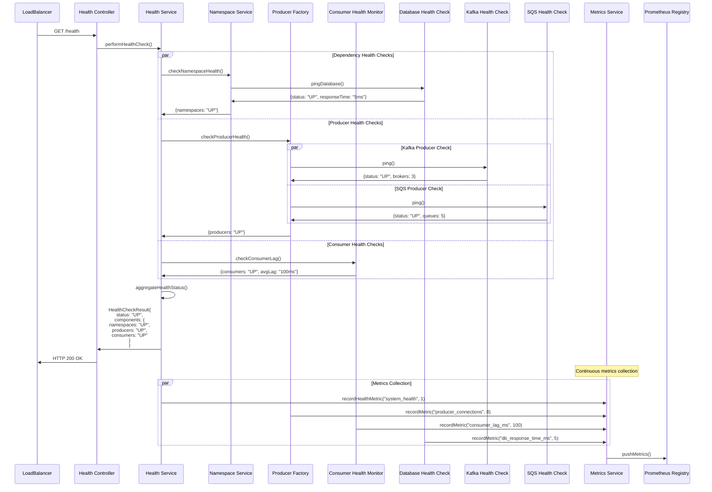

# Generic Write-Ahead Log (WAL) Service - High-Level Design (HLD)

**Version:** 1.0  
**Date:** October 3, 2025  
**Authors:** Senior Software Engineer, Senior Software Architect  
**Technology Stack:** NestJS, TypeScript, Node.js

---

## Table of Contents

1. [System Overview](#1-system-overview)
2. [Architecture Principles](#2-architecture-principles)
3. [System Components](#3-system-components)
4. [Component Interactions](#4-component-interactions)
5. [Sequence Diagrams](#5-sequence-diagrams)
6. [Data Flow Patterns](#6-data-flow-patterns)
7. [Scaling Strategy](#7-scaling-strategy)
8. [Failure Scenarios](#8-failure-scenarios)

---

## 1. System Overview

### 1.1 Purpose and Scope

The Generic Write-Ahead Log (WAL) Service provides a unified abstraction layer for reliable, durable, and scalable message processing across different backend systems. It enables applications to achieve strong consistency guarantees, handle delayed processing, manage cross-region replication, and orchestrate multi-partition transactions.

### 1.2 Key Capabilities

- **Unified API**: Single `WriteToLog` endpoint for all WAL operations
- **Pluggable Backends**: Support for Kafka, SQS, Redis Streams
- **Namespace Isolation**: Logical separation with dedicated configurations
- **Delayed Processing**: Configurable message delays with jitter
- **Cross-Region Replication**: Automatic replication across geographic regions
- **Multi-Partition Transactions**: Orchestrated mutations across multiple systems
- **Dead Letter Queue (DLQ)**: Automated failure handling and recovery
- **Horizontal Scaling**: Shard-based scaling model

### 1.3 High-Level System Architecture

```
┌─────────────────────────────────────────────────────────────────────────────────┐
│                              External Systems                                   │
│  ┌─────────────────┐  ┌─────────────────┐  ┌─────────────────┐               │
│  │  Client Apps    │  │  Load Balancer  │  │  Monitoring     │               │
│  │  (REST/gRPC)    │  │  (NGINX/ALB)    │  │  (Prometheus)   │               │
│  └─────────────────┘  └─────────────────┘  └─────────────────┘               │
└─────────────────────────────────┬───────────────────────────────────────────────┘
                                  │
                                  ▼
┌─────────────────────────────────────────────────────────────────────────────────┐
│                            WAL Service Layer                                    │
│                                                                                 │
│  ┌─────────────────────────────────────────────────────────────────────────────┐│
│  │                         API Gateway Layer                                   ││
│  │  ┌─────────────────┐  ┌─────────────────┐  ┌─────────────────┐           ││
│  │  │  Authentication │  │  Rate Limiting  │  │  Request        │           ││
│  │  │  & Authorization│  │  & Throttling   │  │  Validation     │           ││
│  │  └─────────────────┘  └─────────────────┘  └─────────────────┘           ││
│  └─────────────────────────────────────────────────────────────────────────────┘│
│                                      │                                          │
│  ┌─────────────────────────────────────────────────────────────────────────────┐│
│  │                       Business Logic Layer                                  ││
│  │  ┌─────────────────┐  ┌─────────────────┐  ┌─────────────────┐           ││
│  │  │  WAL Core       │  │  Namespace      │  │  Lifecycle      │           ││
│  │  │  Orchestrator   │  │  Manager        │  │  Manager        │           ││
│  │  └─────────────────┘  └─────────────────┘  └─────────────────┘           ││
│  └─────────────────────────────────────────────────────────────────────────────┘│
│                                      │                                          │
│  ┌─────────────────────────────────────────────────────────────────────────────┐│
│  │                      Message Processing Layer                               ││
│  │  ┌─────────────────┐  ┌─────────────────┐  ┌─────────────────┐           ││
│  │  │  Producer       │  │  Consumer       │  │  Message        │           ││
│  │  │  Framework      │  │  Framework      │  │  Router         │           ││
│  │  └─────────────────┘  └─────────────────┘  └─────────────────┘           ││
│  └─────────────────────────────────────────────────────────────────────────────┘│
└─────────────────────────────────┬───────────────────────────────────────────────┘
                                  │
                                  ▼
┌─────────────────────────────────────────────────────────────────────────────────┐
│                         Infrastructure Layer                                   │
│                                                                                 │
│  ┌─────────────────────────────────────────────────────────────────────────────┐│
│  │                        Message Queues                                       ││
│  │  ┌─────────────────┐  ┌─────────────────┐  ┌─────────────────┐           ││
│  │  │  Apache Kafka   │  │  Amazon SQS     │  │  Redis Streams  │           ││
│  │  │  (Primary)      │  │  (Delayed Msgs) │  │  (Fast Lane)    │           ││
│  │  └─────────────────┘  └─────────────────┘  └─────────────────┘           ││
│  └─────────────────────────────────────────────────────────────────────────────┘│
│                                      │                                          │
│  ┌─────────────────────────────────────────────────────────────────────────────┐│
│  │                         Target Systems                                      ││
│  │  ┌─────────────────┐  ┌─────────────────┐  ┌─────────────────┐           ││
│  │  │  Databases      │  │  Cache Systems  │  │  External APIs  │           ││
│  │  │  (SQL/NoSQL)    │  │  (Redis/Memcd)  │  │  (HTTP/gRPC)    │           ││
│  │  └─────────────────┘  └─────────────────┘  └─────────────────┘           ││
│  └─────────────────────────────────────────────────────────────────────────────┘│
└─────────────────────────────────────────────────────────────────────────────────┘
```

---

## 2. Architecture Principles

### 2.1 Design Principles

| Principle | Description | Implementation |
|-----------|-------------|----------------|
| **Single Responsibility** | Each component has one clear purpose | Separate modules for producers, consumers, targets |
| **Open/Closed Principle** | Open for extension, closed for modification | Plugin architecture for backends and targets |
| **Dependency Inversion** | Depend on abstractions, not concretions | Interface-based design with DI container |
| **Event-Driven Architecture** | Loose coupling through asynchronous events | Message queues as primary communication |
| **Circuit Breaker Pattern** | Fail fast and recover gracefully | Health checks and automatic retry logic |

### 2.2 Quality Attributes

| Attribute | Target | Measurement |
|-----------|--------|-------------|
| **Availability** | 99.9% | Multi-region deployment, health checks |
| **Scalability** | 10K+ TPS per shard | Horizontal scaling, partitioning |
| **Latency** | P99 < 100ms | Async processing, connection pooling |
| **Durability** | 99.99% | Persistent queues, replication |
| **Consistency** | Eventually consistent | Configurable retry policies |

---

## 3. System Components

### 3.1 Core Components Overview

```
┌─────────────────────────────────────────────────────────────────────────────────┐
│                              Component Hierarchy                                │
│                                                                                 │
│    ┌─────────────────────────────────────────────────────────────────────────┐   │
│    │                           API Layer                                     │   │
│    │                                                                         │   │
│    │  ┌─────────────────┐    ┌─────────────────┐    ┌─────────────────┐    │   │
│    │  │  WAL Controller │    │  Health         │    │  Metrics        │    │   │
│    │  │  - writeToLog() │    │  Controller     │    │  Controller     │    │   │
│    │  │  - getStatus()  │    │  - healthCheck()│    │  - getMetrics() │    │   │
│    │  └─────────────────┘    └─────────────────┘    └─────────────────┘    │   │
│    └─────────────────────────────────────────────────────────────────────────┘   │
│                                     │                                           │
│    ┌─────────────────────────────────────────────────────────────────────────┐   │
│    │                        Service Layer                                   │   │
│    │                                                                         │   │
│    │  ┌─────────────────┐    ┌─────────────────┐    ┌─────────────────┐    │   │
│    │  │  WAL Service    │    │  Namespace      │    │  Lifecycle      │    │   │
│    │  │  - orchestrate  │    │  Service        │    │  Service        │    │   │
│    │  │  - validate     │    │  - getConfig    │    │  - handleDelay  │    │   │
│    │  │  - route        │    │  - validate     │    │  - manageRetry  │    │   │
│    │  └─────────────────┘    └─────────────────┘    └─────────────────┘    │   │
│    └─────────────────────────────────────────────────────────────────────────┘   │
│                                     │                                           │
│    ┌─────────────────────────────────────────────────────────────────────────┐   │
│    │                      Infrastructure Layer                              │   │
│    │                                                                         │   │
│    │  ┌─────────────────┐    ┌─────────────────┐    ┌─────────────────┐    │   │
│    │  │  Producer       │    │  Consumer       │    │  Target         │    │   │
│    │  │  Factory        │    │  Framework      │    │  Adapters       │    │   │
│    │  │  - createKafka  │    │  - processMsg   │    │  - executeOp    │    │   │
│    │  │  - createSQS    │    │  - handleError  │    │  - validateTgt  │    │   │
│    │  └─────────────────┘    └─────────────────┘    └─────────────────┘    │   │
│    └─────────────────────────────────────────────────────────────────────────┘   │
└─────────────────────────────────────────────────────────────────────────────────┘
```

### 3.2 Component Responsibilities

#### 3.2.1 API Layer Components

| Component | Primary Responsibilities | Key Interfaces |
|-----------|-------------------------|----------------|
| **WAL Controller** | HTTP request handling, input validation, response formatting | `writeToLog()`, `getStatus()` |
| **Health Controller** | System health monitoring, dependency checks | `healthCheck()`, `readiness()` |
| **Metrics Controller** | Performance metrics exposure, monitoring data | `getMetrics()`, `getNamespaceMetrics()` |

#### 3.2.2 Service Layer Components

| Component | Primary Responsibilities | Key Interfaces |
|-----------|-------------------------|----------------|
| **WAL Service** | Request orchestration, business logic coordination | `writeToLog()`, `validateRequest()` |
| **Namespace Service** | Configuration management, namespace validation | `getNamespace()`, `validateRules()` |
| **Lifecycle Service** | Message lifecycle management, retry coordination | `scheduleDelay()`, `handleRetry()` |

#### 3.2.3 Infrastructure Layer Components

| Component | Primary Responsibilities | Key Interfaces |
|-----------|-------------------------|----------------|
| **Producer Factory** | Backend producer instantiation, connection management | `getProducer()`, `createProducer()` |
| **Consumer Framework** | Message consumption, error handling, scaling | `consume()`, `handleError()` |
| **Target Adapters** | Target system integration, operation execution | `execute()`, `validate()` |

---

## 4. Component Interactions

### 4.1 Request Flow Interaction Pattern

```
Client Request → API Gateway → Service Layer → Infrastructure Layer → Target Systems
     ↑                                                                        ↓
     └─── Response ←──── Orchestration ←──── Message Queue ←──── Async Processing
```

### 4.2 Inter-Component Communication

```
┌─────────────────────────────────────────────────────────────────────────────────┐
│                          Communication Patterns                                 │
│                                                                                 │
│  ┌─────────────────┐    Synchronous     ┌─────────────────┐                   │
│  │   Controller    │ ─────────────────► │   Service       │                   │
│  │                 │                    │                 │                   │
│  └─────────────────┘                    └─────────────────┘                   │
│                                                   │                           │
│                                         Asynchronous                          │
│                                                   ▼                           │
│  ┌─────────────────┐                    ┌─────────────────┐                   │
│  │   Message       │ ◄─────────────────┤   Producer      │                   │
│  │   Queue         │                    │                 │                   │
│  └─────────────────┘                    └─────────────────┘                   │
│           │                                                                   │
│           │ Event-Driven                                                      │
│           ▼                                                                   │
│  ┌─────────────────┐    Interface       ┌─────────────────┐                   │
│  │   Consumer      │ ─────────────────► │   Target        │                   │
│  │                 │                    │   Adapter       │                   │
│  └─────────────────┘                    └─────────────────┘                   │
└─────────────────────────────────────────────────────────────────────────────────┘
```

---

## 5. Sequence Diagrams

### 5.1 Persona #1: Delayed Queue Processing



### 5.2 Persona #2: Cross-Region Replication



### 5.3 Persona #3: Multi-Partition Transaction Orchestration



### 5.4 Dead Letter Queue (DLQ) Management Flow



### 5.5 Health Check and System Monitoring



---

## 6. Data Flow Patterns

### 6.1 Request-Response Flow

```
[Client] → [API Gateway] → [Service Layer] → [Message Queue] → [Response]
                                     ↓
[Target System] ← [Target Adapter] ← [Consumer] ← [Message Queue]
```

### 6.2 Event-Driven Processing Flow

```
[Message Producer] → [Message Queue] → [Message Consumer] → [Target Adapter] → [Target System]
                                              ↓
                         [DLQ] ← [Retry Logic] ← [Error Handler]
```

### 6.3 Cross-Region Replication Flow

```
[Region A] → [Cross-Region Topic] → [Region B Consumer] → [Region B Target]
                    ↓
              [Region C Consumer] → [Region C Target]
```

---

## 7. Scaling Strategy

### 7.1 Horizontal Scaling Model

```
┌─────────────────────────────────────────────────────────────────────────────────┐
│                             Scaling Topology                                   │
│                                                                                 │
│  ┌─────────────────────────────────────────────────────────────────────────────┐│
│  │                           Load Balancer                                     ││
│  │              (Route traffic across WAL service instances)                   ││
│  └─────────────────────────────────────────────────────────────────────────────┘│
│                                     │                                           │
│                    ┌────────────────┼────────────────┐                          │
│                    ▼                ▼                ▼                          │
│  ┌─────────────────────┐  ┌─────────────────────┐  ┌─────────────────────┐     │
│  │   WAL Instance 1    │  │   WAL Instance 2    │  │   WAL Instance N    │     │
│  │   (Shard 1)         │  │   (Shard 2)         │  │   (Shard N)         │     │
│  │                     │  │                     │  │                     │     │
│  │ ┌─────────────────┐ │  │ ┌─────────────────┐ │  │ ┌─────────────────┐ │     │
│  │ │ Namespace A,B   │ │  │ │ Namespace C,D   │ │  │ │ Namespace Y,Z   │ │     │
│  │ └─────────────────┘ │  │ └─────────────────┘ │  │ └─────────────────┘ │     │
│  └─────────────────────┘  └─────────────────────┘  └─────────────────────┘     │
│                                     │                                           │
│  ┌─────────────────────────────────────────────────────────────────────────────┐│
│  │                       Shared Message Queue Layer                           ││
│  │                                                                             ││
│  │  ┌─────────────────┐    ┌─────────────────┐    ┌─────────────────┐        ││
│  │  │ Kafka Cluster   │    │  SQS Queues     │    │ Redis Streams   │        ││
│  │  │ (Partitioned)   │    │ (Per Namespace) │    │ (Fast Lane)     │        ││
│  │  └─────────────────┘    └─────────────────┘    └─────────────────┘        ││
│  └─────────────────────────────────────────────────────────────────────────────┘│
└─────────────────────────────────────────────────────────────────────────────────┘
```

### 7.2 Scaling Triggers and Thresholds

| Metric | Scale-Out Trigger | Scale-In Trigger |
|--------|-------------------|------------------|
| **CPU Utilization** | > 70% for 5 minutes | < 30% for 15 minutes |
| **Memory Usage** | > 80% for 5 minutes | < 40% for 15 minutes |
| **Request Rate** | > 8K TPS per instance | < 2K TPS per instance |
| **Queue Depth** | > 1000 messages | < 100 messages |
| **Response Latency** | P95 > 150ms | P95 < 50ms |

---

## 8. Failure Scenarios

### 8.1 Component Failure Scenarios

| Failure Type | Impact | Recovery Strategy | RTO/RPO |
|--------------|--------|-------------------|---------|
| **WAL Service Instance** | Reduced capacity | Auto-scaling, health checks | RTO: 2 min, RPO: 0 |
| **Message Queue** | Processing halt | Failover to backup cluster | RTO: 5 min, RPO: 0 |
| **Target System** | Data operations fail | Retry with exponential backoff | RTO: Variable, RPO: 0 |
| **Database (Namespace)** | Configuration unavailable | Read-only mode with cached config | RTO: 1 min, RPO: 5 min |
| **Network Partition** | Cross-region replication fails | Local processing continues | RTO: Auto, RPO: 0 |

### 8.2 Disaster Recovery Scenarios

| Scenario | Recovery Approach | Maximum Acceptable Loss |
|----------|-------------------|-------------------------|
| **Regional Outage** | Failover to secondary region | 15 minutes of processing time |
| **Data Center Loss** | Multi-AZ deployment with failover | 5 minutes of processing time |
| **Kafka Cluster Failure** | Switch to SQS backend temporarily | 0 message loss (queued messages) |
| **Complete Service Failure** | Restore from backup, replay from last checkpoint | 1 hour of configuration changes |

---

**End of High-Level Design Document**